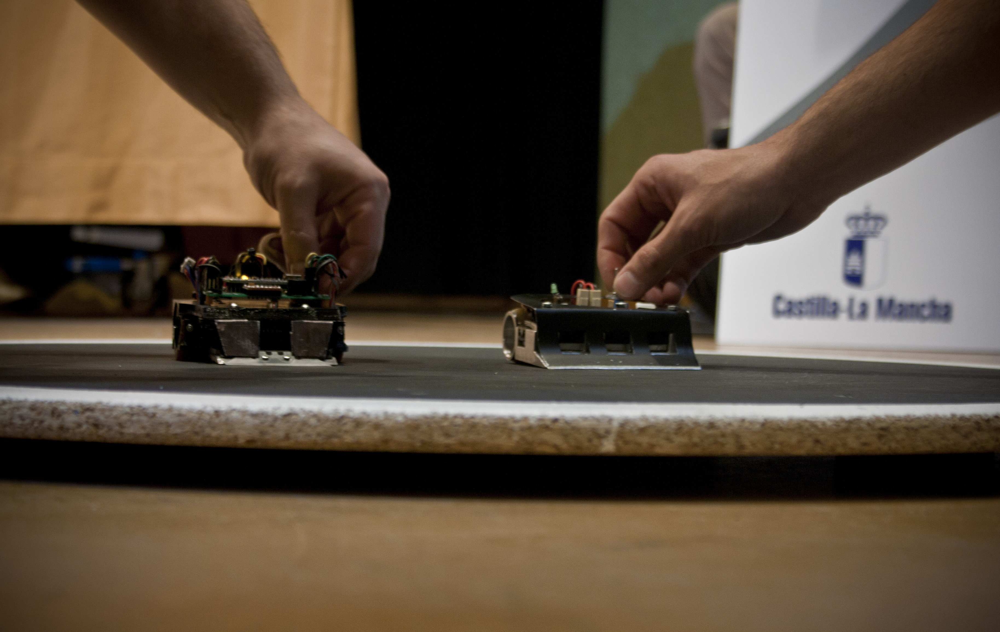

# Normativa para minisumo
La categoría de minisumo consiste en una prueba de lucha en la que dos robots intentan empujar al contrario para echarlo del dohyo.

# Índice

 - [Robots y homologación](robots.md)
 - [Dohyo](dohyo.md)
 - [Competición y puntuación](competicion.md)

# Atribuciones

Esta normativa se basa en la normativa de la [OSHWDem](https://oshwdem.org/) y en elementos de otras competiciones compatibles como [RobotChallenge](http://www.robotchallenge.org.cn/), [RoboGames](http://robogames.net) y la [LNRC](http://lnrc.es/).

# Contribuidores

 - [BricoLabs](https://github.com/BRICO-LABS)
 - [AlejandraSaku](https://github.com/AlejandraSaku)
 - [JavierIH](https://github.com/JavierIH)
 - [Resaj](https://github.com/Resaj)

# Recursos de interés

# Licencia

